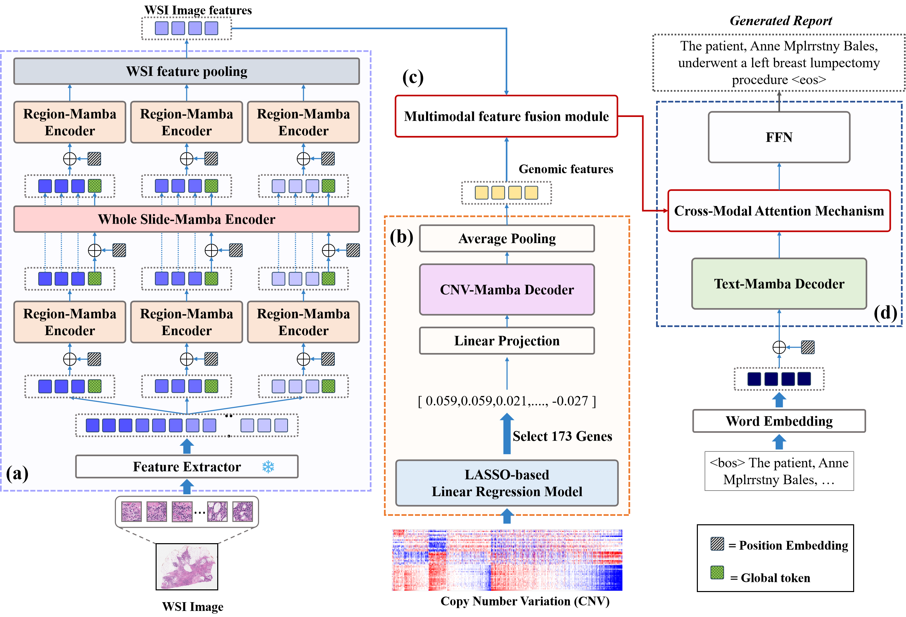

# SPECTRA : Slide-based Pathology and gEnomiC daTa for Reporting and Analysis
This is the official pytorch implementation repository of our SPECTRA : Slide-based Pathology and gEnomiC daTa for Reporting and Analysis.

## SPECTRA Architecture

  

## Dataset
- We have used the following datasets:
  -  Histopathology WSIs (TGCA-BRCA, TGCA-LUAD): Heath, A.P., Ferretti, V., Agrawal, S., An, M., Angelakos, J.C., Arya, R., Bajari, R., Baqar, B., Barnowski, J.H., Burt, J., et al.: The nci genomic data commons. Nature genetics 53(3), 257–262 (2021)
  -  CNV profiles: Goldman, M.J., Craft, B., Hastie, M., Repečka, K., McDade, F., Kamath, A., Banerjee, A., Luo, Y., Rogers, D., Brooks, A.N., et al.: Visualizing and interpreting cancer genomics data via the xena platform. Nature biotechnology 38(6), 675–678 (2020)
  -  Diagnostic reports: TGCA-BRCA (Chen, P., Li, H., Zhu, C., Zheng, S., Shui, Z., Yang, L.: Wsicaption: Multiple instance generation of pathology reports for gigapixel whole-slide images. In: International Conference on Medical Image Computing and Computer-Assisted Intervention. pp. 546–556.Springer (2024)) and TGCA-LUAD (Guo, Z., Ma, J., Xu, Y., Wang, Y., Wang, L., Chen, H.: Histgen: Histopathology report generation via local-global feature encoding and cross-modal context interaction. In: International Conference on Medical Image Computing and Computer-Assisted Intervention. pp. 189–199. Springer (2024)) 

## Prerequesites
- python 3.8
- pytorch 2.1.1
- causal-conv1d 1.4.0
- mamba-ssm 2.2.2
  
